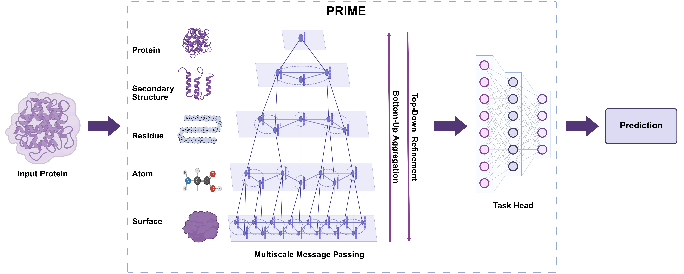

# PRIME: Protein Representation via Physics-Informed Multiscale Equivariant Hierarchies

PRIME is a hierarchical graph representation learning framework that models proteins as a nested family of five physically grounded structural graphs spanning surface, atomic, residue, secondary-structure, and protein levels.

## Overview



## Requirements

Install the required dependencies:
```bash
pip install -r requirements.txt
```

## Data Preparation

**Step 1: Download processed data from ProteinWorkshop**

Download the preprocessed datasets and standard splits from the [ProteinWorkshop repository](https://github.com/a-r-j/ProteinWorkshop). Follow their instructions to download the datasets for the tasks you wish to evaluate:
- Fold Classification
- Reaction Class Prediction
- Gene Ontology Prediction
- PPI Site Prediction

**Step 2: Build hierarchical graphs**

Before training, you need to construct the hierarchical protein graphs for each task. Open `utils/hierarchical_graph.sh` and configure the paths and task name for your specific setup, then run:

```bash
bash utils/hierarchical_graph.sh
```

This script processes the raw protein structures and builds the five-level hierarchical graph representation for each protein in the dataset.

## Training

Open `train_prime.sh` and configure the following settings for your specific usage:
- Task name
- Active hierarchy levels
- Readout level
- Output checkpoint path
- Any other hyperparameters

Then run:
```bash
bash train_prime.sh
```

## Testing

Open `test_prime.sh` and configure the checkpoint path and task settings, then run:
```bash
bash test_prime.sh
```

## Configuration

All model and training hyperparameters are managed through the configuration files in the `config/` directory. Please review and update the relevant config file before running any scripts.

## If our work is useful, please cite our paper!

```bibtex
@misc{nguyen2026primeproteinrepresentationphysicsinformed,
      title={PRIME: Protein Representation via Physics-Informed Multiscale Equivariant Hierarchies}, 
      author={Viet Thanh Duy Nguyen and John K. Johnstone and Truong-Son Hy},
      year={2026},
      eprint={2605.01625},
      archivePrefix={arXiv},
      primaryClass={cs.LG},
      url={https://arxiv.org/abs/2605.01625}, 
}
```

## License

This project is licensed under the MIT License. See the [LICENSE](LICENSE) file for details.
