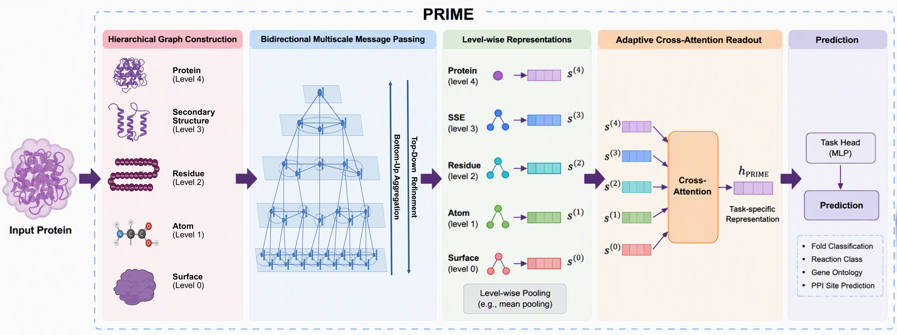

# PRIME: Protein Representation via Physics-Informed Multiscale HiErarchies

[](https://arxiv.org/abs/2605.01625)
[](LICENSE)

PRIME is a physics-informed framework for hierarchical protein representation learning. It models each protein as a nested family of five physically grounded structural graphs (**molecular surface**, **atom**, **residue**, **secondary structure**, and **protein**) and learns representations at every level jointly.



## Installation

```bash
git clone https://github.com/HySonLab/PRIME.git
cd PRIME
pip install -r requirements.txt
```

## Data Preparation

**Step 1: Download processed data from ProteinWorkshop**

Download the preprocessed datasets and standard splits from the [ProteinWorkshop repository](https://github.com/a-r-j/ProteinWorkshop). Follow their instructions for the tasks you want to evaluate:

- Fold Classification (`FoldClassification`)
- Reaction Class Prediction (`ECReaction`)
- Gene Ontology Prediction (`GeneOntology`)
- PPI Site Prediction (`BindingSite`)

Place the processed files for each task in this layout:

```
data/downstream_task_data/
└── {TASK}/
    ├── processed/   # input: processed .pt files from ProteinWorkshop
    └── graphs/      # output: hierarchical graphs (created automatically)
```

Then set `data_root` in `config/data_config.yaml` to your local data directory.

**Step 2 (optional): Pretrain the geometric encoders**

PRIME can use pretrained encoders for the surface level (EMNN) and the atom level (EGNN). To train them yourself, download the pretraining data. In this study we use the protein structures and surface meshes released with [MaSIF](https://github.com/LPDI-EPFL/masif):

```bash
wget -O masif_data.tar.gz "https://zenodo.org/records/2625420/files/masif_site_masif_search_pdbs_and_ply_files.tar.gz?download=1"
tar -xzf masif_data.tar.gz
```

Place the extracted folders in this layout:

```
data/pretrain_data/
├── 01-benchmark_pdbs/       # protein structures (.pdb)
└── 01-benchmark_surfaces/   # molecular surface meshes (.ply)
```

Then pretrain each encoder:

```bash
python pretrain_atom_egnn.py      # atom-level EGNN encoder
python pretrain_surface_emnn.py   # surface-level EMNN encoder
```

Both encoders are trained with a self-supervised coordinate-denoising objective. To use them, set `ATOM_ENCODER_PATH` and `SURFACE_ENCODER_PATH` in `utils/hierarchical_graph.sh` to the resulting checkpoints. You can skip this step: with no encoders, PRIME uses handcrafted geometric features, which perform nearly as well.

**Step 3: Build hierarchical graphs**

`utils/hierarchical_graph.sh` is a wrapper around `utils/hierarchical_graph.py`. For one task, it converts the processed protein structures into PRIME's five-level hierarchical graphs.

Edit the fields at the top of the script:

| Field | Default | Description |
|---|---|---|
| `TASK` | `FoldClassification` | Task to process (see table above) |
| `BASE_DIR` | `./data/downstream_task_data` | Root folder containing one subfolder per task |
| `ATOM_ENCODER_PATH` | `""` (disabled) | *Optional.* Pretrained atom-level EGNN encoder checkpoint |
| `SURFACE_ENCODER_PATH` | `""` (disabled) | *Optional.* Pretrained surface-level EMNN encoder checkpoint |

The input path (`{BASE_DIR}/{TASK}/processed`) and the output path (`{BASE_DIR}/{TASK}/graphs`) are set automatically from `BASE_DIR` and `TASK`.

Then run:

```bash
bash utils/hierarchical_graph.sh
```

## Training

Training is launched with `train_prime.sh`. Open the script and edit the fields at the top.

**Basic settings**

| Field | Default | Description |
|---|---|---|
| `TASK` | `FoldClassification` | `FoldClassification` \| `ECReaction` \| `GeneOntology` \| `BindingSite` |
| `SEED` | `1` | Random seed. Paper results are the mean over seeds `1`, `2`, `3` |
| `CROSS_ATTENTION` | `"true"` | Adaptive cross-attention readout over all levels (**full PRIME**). Set to `"false"` for **PRIME-Fixed**, which reads out from the single level in `READOUT_LEVEL` |
| `GO_BRANCH` | `"MF"` | Gene Ontology only: Molecular Function (`MF`), Biological Process (`BP`), or Cellular Component (`CC`) |
| `RESUME` | `"false"` | Set to `"true"` to resume from the latest checkpoint |

> **PPI site prediction** (`BindingSite`) is a per-residue task, so it always predicts from the final residue-level representations and does not use the cross-attention readout. Those residue representations still carry information from all five levels via message passing.

**Run**

```bash
bash train_prime.sh
```

## Testing

Set `test_prime.sh` to the same settings you trained with (task, seed, `CROSS_ATTENTION`, and any ablation options), then run:

```bash
bash test_prime.sh
```

The checkpoint path is resolved automatically from these settings.

## Ablations

These fields in `train_prime.sh` reproduce the ablation studies in the paper. Leave them at their defaults to train the full model.

| Field | Default | Options | Controls |
|---|---|---|---|
| `CROSS_ATTENTION` | `"true"` | `"true"` \| `"false"` | Adaptive readout (PRIME) vs. fixed single-level readout (PRIME-Fixed) |
| `READOUT_LEVEL` | `residue` | `surface` \| `atom` \| `residue` \| `sse` \| `protein` | Readout level when `CROSS_ATTENTION="false"` |
| `ACTIVE_LEVELS` | all five | any subset of `surface` `atom` `residue` `sse` `protein` | Which hierarchy levels are used |
| `DIRECTION` | `bidirectional` | `bidirectional` \| `bottom_up_only` \| `top_down_only` | Direction of cross-level message passing |

To reproduce the paper's ablation settings:

- **Adaptive vs. fixed readout:** run with `CROSS_ATTENTION="true"` and `"false"` (with `READOUT_LEVEL="residue"`).
- **Level removal and message-passing direction:** these use PRIME-Fixed (`CROSS_ATTENTION="false"`, `READOUT_LEVEL="residue"`), so the readout can't compensate by shifting attention to the remaining levels. For example, to remove the surface level:

```bash
CROSS_ATTENTION="false"
READOUT_LEVEL="residue"
ACTIVE_LEVELS=("atom" "residue" "sse" "protein")
```

- **Pretrained vs. handcrafted features:** rebuild the graphs with both encoder paths left empty in `utils/hierarchical_graph.sh`.

## Outputs

Logs and the best checkpoint are saved to:

```
./logs/training_log_prime_{task}_{level_tag}_seed{N}.txt
./ckpts/best_prime_{task}_{level_tag}_seed{N}.pt
```

where `{level_tag}` is the active levels joined by underscores (default `surface_atom_residue_sse_protein`) and `{N}` is the seed.

## Repository Structure

```
PRIME/
├── config/
│   ├── data_config.yaml        # dataset paths and split files
│   └── model_config.yaml       # model architecture hyperparameters
├── utils/
│   ├── hierarchical_graph.sh   # builds the five-level graphs
│   └── hierarchical_graph.py
├── figures/
├── train_prime.sh
├── test_prime.sh
├── requirements.txt
└── LICENSE
```

## Citation

If you find PRIME useful, please cite:

```bibtex
@misc{nguyen2026prime,
      title={PRIME: Protein Representation via Physics-Informed Multiscale HiErarchies},
      author={Viet Thanh Duy Nguyen and John K. Johnstone and Truong-Son Hy},
      year={2026},
      eprint={2605.01625},
      archivePrefix={arXiv},
      primaryClass={cs.LG},
      url={https://arxiv.org/abs/2605.01625},
}
```

## Acknowledgements

Datasets, splits, and baseline results are from [ProteinWorkshop](https://github.com/a-r-j/ProteinWorkshop). Surface meshes are generated with PyMOL and simplified with Open3D. Secondary structure is assigned with DSSP via `pydssp`.

## License

This project is licensed under the MIT License. See [LICENSE](LICENSE) for details.
